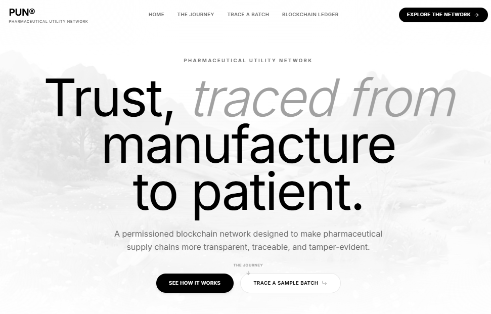
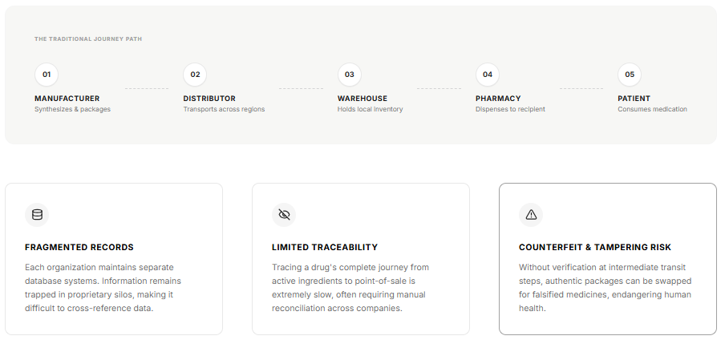
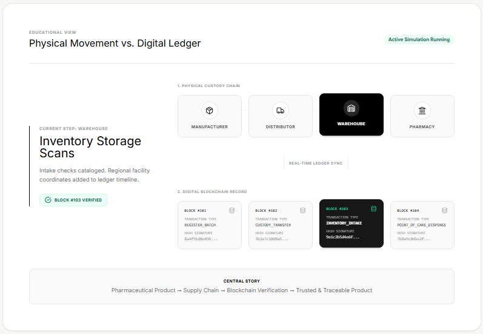
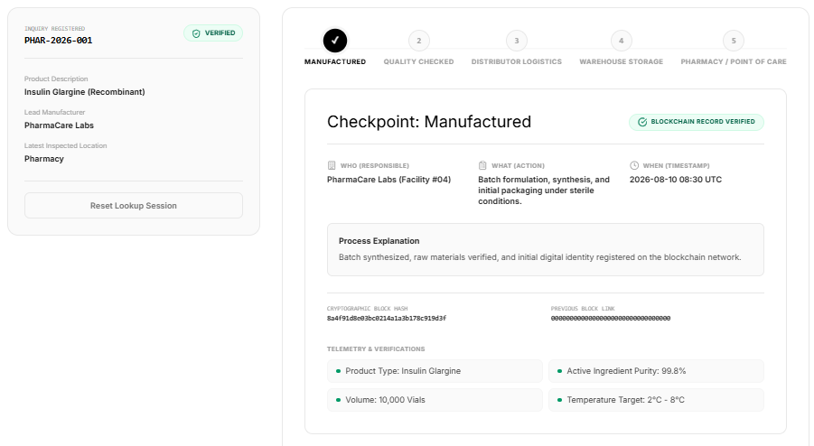
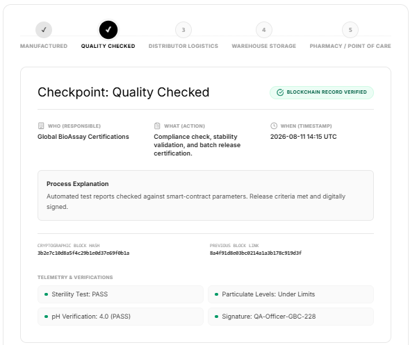
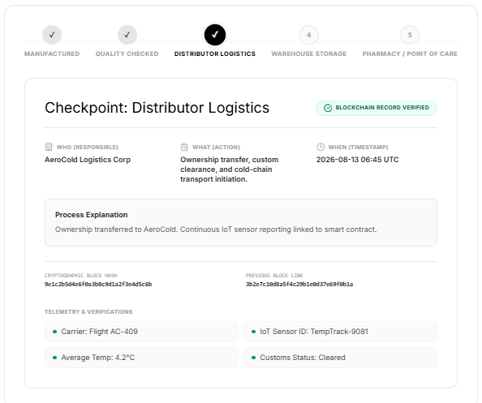
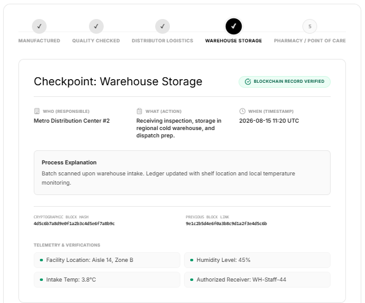
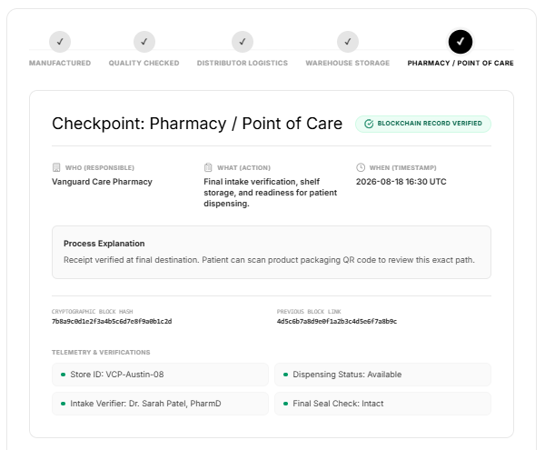
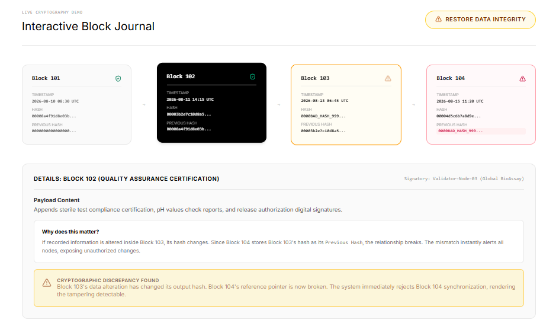
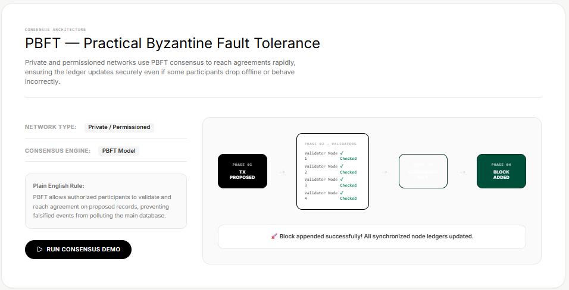

# 💊 Pharmaceutical Utility Network

A blockchain-inspired platform demonstrating how a **permissioned blockchain model** can improve **pharmaceutical supply-chain traceability, transparency, and product integrity**.

🌐 **Live Demo:** https://pharmaceutical-utility-network.vercel.app/

---

## ✨ Key Features

* 💊 Pharmaceutical batch traceability
* 🔗 Hash-linked blockchain records
* 🏭 Manufacturing and quality checkpoints
* 🚚 Distributor and logistics tracking
* 🏬 Warehouse monitoring
* 💉 Pharmacy verification
* 📖 Interactive block journal
* ⚠️ Tampering detection simulation
* 🤝 PBFT consensus simulation
* 📜 Smart-contract rule simulation

---

# 🔄 Supply Chain Flow

```text
Manufacturer
     ↓
Quality Assurance
     ↓
Distributor & Logistics
     ↓
Warehouse
     ↓
Pharmacy
     ↓
Product Verification
```

---

# 📸 Application Screenshots

## 🏠 Fig. 1 — PUN Landing Page

The main landing page introducing the Pharmaceutical Utility Network.



---

## ⚠️ Fig. 2 — Traditional Pharmaceutical Supply Chain

Illustrates the traditional pharmaceutical supply chain and its challenges.



---

## 🔄 Fig. 3 — Physical Movement vs Digital Blockchain Ledger

Demonstrates the physical movement of a pharmaceutical batch alongside its digital blockchain record.



---

## 🏭 Fig. 4 — Manufacturing Checkpoint

Shows the pharmaceutical batch creation and blockchain record verification stage.



---

## ✅ Fig. 5 — Quality Checkpoint

Demonstrates certification and compliance verification.



---

## 🚚 Fig. 6 — Distributor & Logistics Checkpoint

Displays shipment and logistics tracking during the distribution stage.



---

## 🏬 Fig. 7 — Warehouse Storage Checkpoint

Shows warehouse intake, storage information, and environmental monitoring.



---

## 💊 Fig. 8 — Pharmacy / Point of Care Checkpoint

Demonstrates the final pharmaceutical product verification stage.



---

## 📖 Fig. 9 — Interactive Block Journal

Displays blockchain-style records and demonstrates blockchain integrity and tampering detection.



---

## 🤝 Fig. 10 — PBFT Consensus Demonstration

Demonstrates the Practical Byzantine Fault Tolerance consensus process using validator nodes.

```text
Transaction Proposed
        ↓
Validator Nodes
        ↓
Transaction Validation
        ↓
Consensus Reached
        ↓
Block Added
```



---

# 🔐 Blockchain Concepts Demonstrated

### 🔗 Cryptographic Hashing

Records are linked using hashes, making unauthorized modifications detectable.

### 🤝 PBFT Consensus

Authorized validator nodes participate in validating transactions before records are added.

### 📜 Smart Contracts

Predefined conditions are used to demonstrate rule-based supply-chain actions.

### 🔍 Batch Traceability

The platform demonstrates tracking a pharmaceutical batch across different supply-chain stages.

---

# ⚙️ Technology Stack

* React
* TypeScript
* Modern frontend technologies
* Mock data for blockchain simulation

> This project is an educational frontend simulation and does not perform real blockchain transactions.

## 👩‍💻 Project

**Supply Chain: Protect Pharmaceutical Product Integrity with the Pharmaceutical Utility Network**
